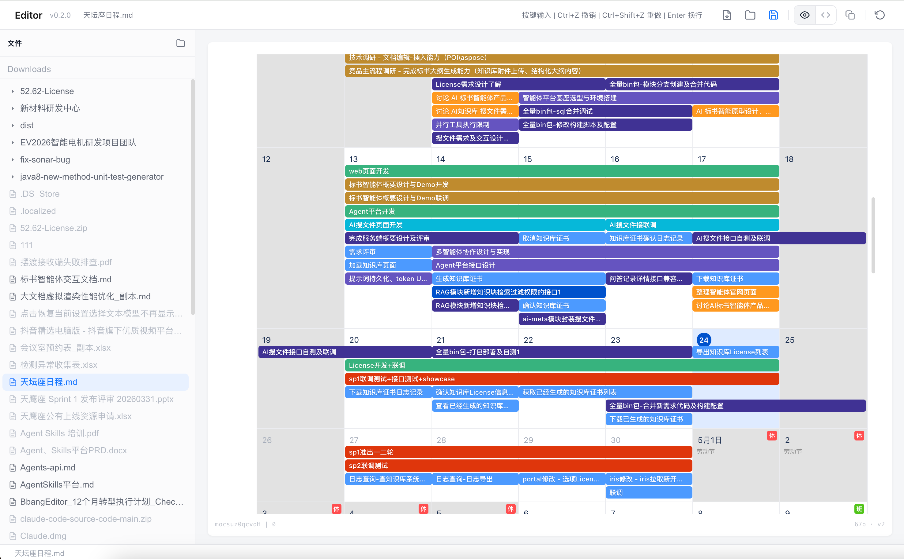

# BbangEditor

> **一款高性能、块级（Block-Based）现代文档编辑器。** 
> 结合了 Markdown 的简洁与 Notion 般的交互体验，专为处理大规模文档与复杂协作场景设计。



## ✨ 功能特性

### 📝 现代块级编辑
- **丰富的基础块**：支持段落、各级标题、引用、列表（无序、有序、待办事项）、分割线等。
- **Notion 交互体验**：支持 `/` 斜杠命令快速插入块，拥有平滑的拖拽体验。
- **选区浮动工具栏**：选中文字即刻弹出格式化菜单，支持加粗、斜体、颜色、背景色等。

### 📊 专业级表格 (Table)
- **高性能渲染**：支持超大规模表格的行虚拟化，保持丝滑滚动。
- **深度交互**：支持行列自由拖动调整宽度、单元格合并与拆分、便捷的行列增删工具栏。

### 📅 项目日历 (Calendar)
- **可视化日程管理**：内置功能强大的日历块，支持多月份纵向滚动查看。
- **事件管理**：支持点击/拖拽创建事件、事件分组展示（按负责人等）、节假日自动高亮。

### 💻 开发者友好
- **全功能代码块**：集成 CodeMirror 6，支持多种主流编程语言语法高亮、代码折叠及多款精美主题。
- **Markdown 双向支持**：实时 Markdown 解析与导出，支持 Markdown 快捷输入（如 `# ` 自动转标题）。

### 🚀 卓越性能与体验
- **大文档虚拟滚动**：即使是数万行的超长文档，也能实现即开即看，无内存压力，滚动不掉帧。
- **自研渲染引擎**：基于现代 Web Components 技术打造，确保跨平台渲染的一致性与高性能。
- **双模式体验**：支持全能编辑模式与沉浸式阅读预览模式。
- **目录大纲**：自动提取文档标题生成大纲，点击快速跳转。

## 📥 下载安装

| 版本 | 平台 | 文件 | 日期 |
|------|------|------|------|
| v0.2.0 | macOS (Apple Silicon) | [BbangEditor-0.2.0-arm64.dmg](https://github.com/JiuYoStar/editor-demo/releases/download/v0.2.0/BbangEditor-0.2.0-arm64.dmg) | 2026-04-24 |

> [!TIP]
> 由于当前未配置 Apple Developer ID 签名，macOS 首次打开可能会提示“无法验证开发者”。
> **解决方法**：前往“系统设置 → 隐私与安全性 → 仍要打开”，或在终端执行以下命令：
> ```shell
> xattr -dr com.apple.quarantine /Applications/BbangEditor.app
> ```

## 📅 更新日志

### v0.2.0 (2026-04-24)
- **[新增]** 全新 **Calendar 日历块**：支持日程管理、拖拽创建与节假日显示。
- **[增强]** 表格功能重构：新增列宽调整、合并拆分及虚拟化渲染。
- **[优化]** 大文档加载性能：引入分层布局计算与虚拟窗口渲染技术。
- **[优化]** UI 设计升级：更加现代化的工具栏与交互动效。

### v0.1.0 (2026-04-20)
- 首次发布，支持基础 Markdown 块编辑与 Electron 桌面客户端打包。

---

© 2026 JiuYoStar. Built with ❤️ for writers and developers.